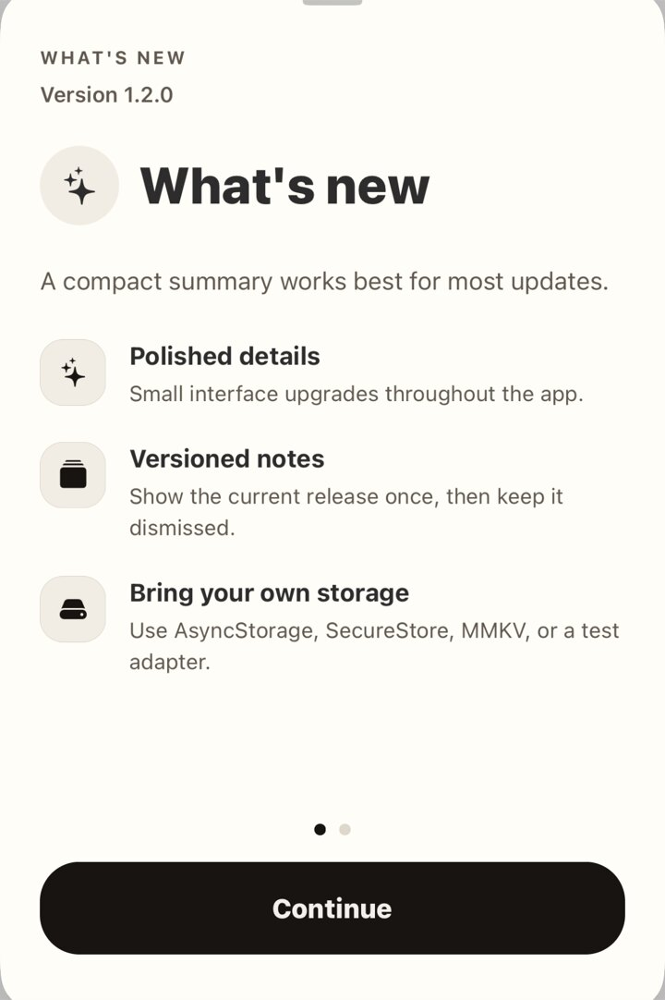

# Expo What's New Sheet

Lightweight, data-first "What's New" sheets for Expo and React Native apps.

`@r4z33n4l1/whats-new-sheet` gives you a polished release-notes surface without forcing a backend, admin dashboard, storage package, or navigation pattern into your app. Describe the update as data, present it in a sheet, and mark the version as seen.

## Highlights

- **Small API surface**: `WhatsNewSheet`, `useWhatsNew`, and `createWhatsNewController`.
- **Typed release notes**: list, image, and custom pages.
- **Bring your own storage**: AsyncStorage, SecureStore, MMKV, Convex, local state, or test memory.
- **Bring your own routing**: works with Expo Router form sheets, React Navigation modals, or any host screen.
- **Expo-friendly visuals**: image pages and SF Symbol row icons are rendered through `expo-image`.
- **No native surprise**: no video module, no config plugin, no autolinking beyond `expo-image`.

## Screenshots

These are cropped simulator screenshots from the example app, focused only on the sheet UI.

| List page | Image page |
|---|---|
|  |  |

## Install

```sh
npm install @r4z33n4l1/whats-new-sheet expo-image
```

Most Expo apps already have these peer dependencies:

```sh
npm install react react-native expo
```

The package intentionally does **not** install storage for you. That keeps the library portable and avoids locking consumers into one persistence choice.

## Quick Start

```tsx
import AsyncStorage from '@react-native-async-storage/async-storage';
import { router } from 'expo-router';
import {
  WhatsNewSheet,
  useWhatsNew,
  type WhatsNewAnnouncement,
  type WhatsNewStorageAdapter,
} from '@r4z33n4l1/whats-new-sheet';

const announcements: WhatsNewAnnouncement[] = [
  {
    version: '1.2.0',
    title: 'Version 1.2.0',
    pages: [
      {
        type: 'list',
        title: 'More ways to plan your week',
        body: 'A concise summary of what changed in this release.',
        rows: [
          {
            icon: 'calendar.badge.clock',
            title: 'Recurring workouts',
            description: 'Save repeating sessions once, then update them anytime.',
          },
          {
            icon: 'rectangle.stack.fill',
            title: 'Cleaner history',
            description: 'Recent workouts are easier to scan and compare.',
          },
        ],
      },
    ],
  },
];

const storage: WhatsNewStorageAdapter = {
  getItem: AsyncStorage.getItem,
  setItem: AsyncStorage.setItem,
  removeItem: AsyncStorage.removeItem,
};

export function WhatsNewRoute() {
  const { pendingAnnouncement, dismiss } = useWhatsNew({
    announcements,
    currentVersion: '1.2.0',
    storage,
  });

  if (!pendingAnnouncement) {
    return null;
  }

  return (
    <WhatsNewSheet
      announcement={pendingAnnouncement}
      autoDismissOnUnmount
      onDismiss={async () => {
        await dismiss(pendingAnnouncement);
        router.back();
      }}
    />
  );
}
```

## Expo Router Form Sheet

The library renders the content. Your app owns the route.

```tsx
import { Stack } from 'expo-router';

export default function Layout() {
  return (
    <Stack>
      <Stack.Screen
        name="whats-new"
        options={{
          presentation: 'formSheet',
          sheetGrabberVisible: true,
          sheetAllowedDetents: [0.75, 0.92],
          sheetCornerRadius: 24,
          headerShown: false,
          contentStyle: { backgroundColor: 'transparent' },
        }}
      />
    </Stack>
  );
}
```

## Page Types

### `list`

The best default for release notes. Keep the title outcome-focused and the rows short.

```ts
{
  type: 'list',
  title: 'See your progress more clearly',
  body: 'A short optional summary can set context.',
  rows: [
    {
      icon: 'chart.bar.xaxis.ascending',
      title: 'Movement breakdown',
      description: 'Total sessions, weekly averages, and peak weeks.',
    },
  ],
}
```

Row icons are SF Symbol names rendered by `expo-image`. Prefixing with `sf:` is optional.

### `image`

Use for a single strong visual, screenshot, or product preview.

```ts
{
  type: 'image',
  source: 'https://example.com/release-preview.jpg',
  title: 'A calmer calendar',
  description: 'The new month view gives each week more breathing room.',
}
```

The `source` accepts a remote URL, a local asset number, or `{ uri: string }`.

### `custom`

Use this when one page needs app-specific React rendering.

```tsx
{
  type: 'custom',
  render: ({ dismiss, goNext, isLastPage }) => (
    <YourLaunchMoment onDone={dismiss} />
  ),
}
```

Custom pages are powerful, but keep them rare. The package is easiest to maintain when most notes stay data-driven.

## Storage

Seen state is stored as a JSON array of announcement keys. By default, the key is the announcement `version`; set `storageKey` on an announcement if you need a different identity.

```ts
export type WhatsNewStorageAdapter = {
  getItem(key: string): Promise<string | null> | string | null;
  setItem(key: string, value: string): Promise<void> | void;
  removeItem(key: string): Promise<void> | void;
};
```

In-memory adapter for demos and tests:

```ts
const store = new Map<string, string>();

export const memoryStorage = {
  getItem: (key: string) => store.get(key) ?? null,
  setItem: (key: string, value: string) => {
    store.set(key, value);
  },
  removeItem: (key: string) => {
    store.delete(key);
  },
};
```

## API Reference

### `WhatsNewSheet`

```ts
type WhatsNewSheetProps = {
  announcement: WhatsNewAnnouncement;
  onDismiss: () => void;
  onAction?: (action: WhatsNewAction, announcement: WhatsNewAnnouncement) => void;
  theme?: WhatsNewTheme;
  bottomInset?: number;
  autoDismissOnUnmount?: boolean;
};
```

`autoDismissOnUnmount` is useful for swipe-to-dismiss sheets. If the route unmounts without a button press, the sheet still calls `onDismiss`.

### `useWhatsNew`

```ts
const {
  pendingAnnouncement,
  isLoading,
  dismiss,
  reset,
  markSeen,
} = useWhatsNew({
  announcements,
  currentVersion: '1.2.0',
  storage,
});
```

The hook returns the first unseen announcement. If `currentVersion` is provided, it only considers matching announcements.

### `createWhatsNewController`

```ts
const controller = createWhatsNewController({ storage });

const pending = await controller.getPendingAnnouncement(announcements, '1.2.0');
await controller.markSeen(announcements[0]);
await controller.reset();
```

Use the controller in route files, tests, or integration layers that should not use React hooks.

## Theming

Pass a small theme object when you want the sheet to match your app.

```tsx
<WhatsNewSheet
  announcement={announcement}
  onDismiss={dismiss}
  theme={{
    accentColor: '#2D2D2D',
    backgroundColor: '#F3F0EB',
    foregroundColor: '#2D2D2D',
    mutedColor: '#5C5C5C',
    cardColor: '#E9E4DC',
    borderColor: 'rgba(0, 0, 0, 0.08)',
    buttonForegroundColor: '#F3F0EB',
    cornerRadius: 16,
    doneButtonLabel: 'Got it',
  }}
/>
```

## Example App

The repo includes an Expo Router playground in [`example/`](./example). It demonstrates:

- A form-sheet route.
- Static local announcement data.
- An in-memory storage adapter.
- List, image, and custom pages.
- Manual preview and reset controls.

The screenshots above are stored in [`docs/assets`](./docs/assets) and are cropped to the sheet surface only.

Run it with:

```sh
corepack yarn install
corepack yarn example start
```

## Development

```sh
corepack yarn install
corepack yarn typecheck
corepack yarn prepare
npm pack --dry-run
```

This package uses `react-native-builder-bob` with an ESM-only build and TypeScript declarations.

## Publishing

Before publishing:

```sh
corepack yarn typecheck
corepack yarn prepare
npm pack --dry-run
```

The first publish of a scoped package must be public:

```sh
npm publish --access public
```

## Design Notes

- Keep release notes short. Three rows usually reads better than six.
- Prefer one clear CTA over multiple competing actions.
- Use `custom` pages only when data cannot express the moment.
- Avoid bundling optional native modules. This package intentionally removed video support from v1 so it works in existing Expo dev builds without a rebuild.

## Acknowledgements

Thanks to [Notelet](https://github.com/mykolaharmash/notelet) by Mykola Harmash for inspiration around small, versioned release-note surfaces.

## License

MIT
